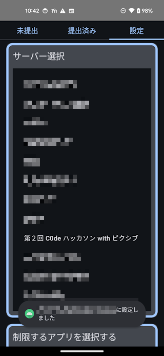
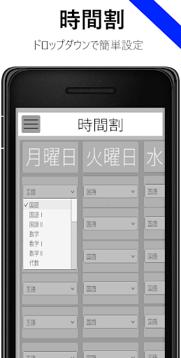
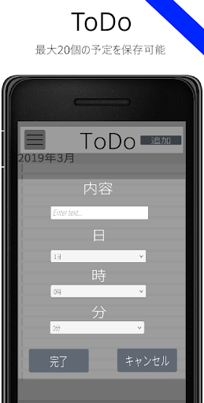
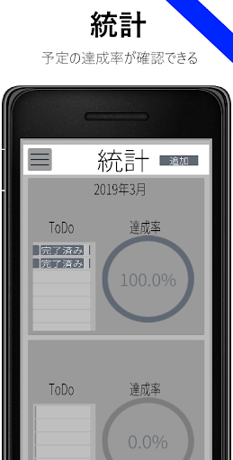

# これまでの成果物
## 2024
### TaskMate（[第2回 C0deハッカソン with pixiv](https://x.com/pixiv_corp/status/1864218084682461636)にて制作）

<video src="assets/works/taskmate_assignmentscreen.mp4" controls  width="180"></video>
  

#### 概要
詳しくは[こちら](https://qiita.com/Punyo/items/15a8d9fb42ec37f57280)へ

#### 使用技術
- Jetpack Compose
- WebView
- Ktor
- Node.js

#### リンク
- [Qiitaでの紹介記事](https://qiita.com/Punyo/items/15a8d9fb42ec37f57280)

### NITechSearch：名工大の講義室使用状況検索アプリ

#### 概要
詳しくは[こちら](works/nitechvacancyviewer)へ

#### 使用技術
- Jetpack Compose 
- WebView
- Retrofit

#### リンク
- [GitHub](https://github.com/Punyo/NITechVacancyViewer)
- [Google Play](https://play.google.com/store/apps/details?id=com.punyo.nitechvacancyviewer)

## 2021
### 単語帳アプリ

#### 概要

#### 使用技術
- Xamarin.Android

## 2020
### 時間割＆ToDo - 時間割、ToDoリスト

    
    
    
    

#### 概要

#### 使用技術
- Unity

#### リンク
- ~~Google Play~~ 配信停止済み