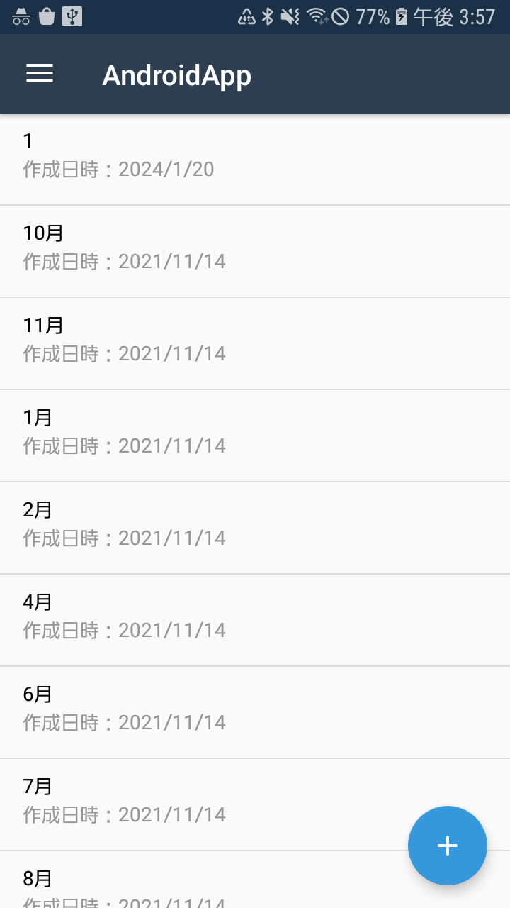
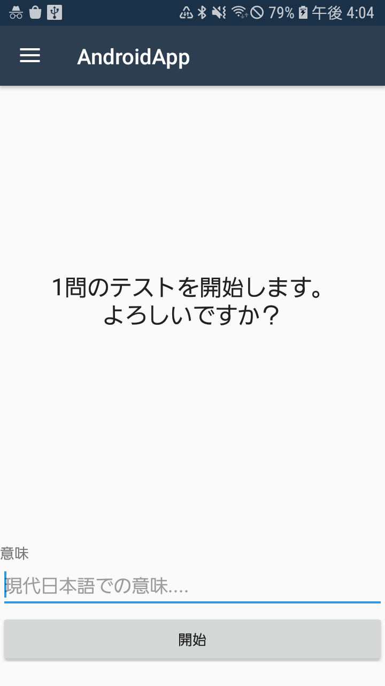
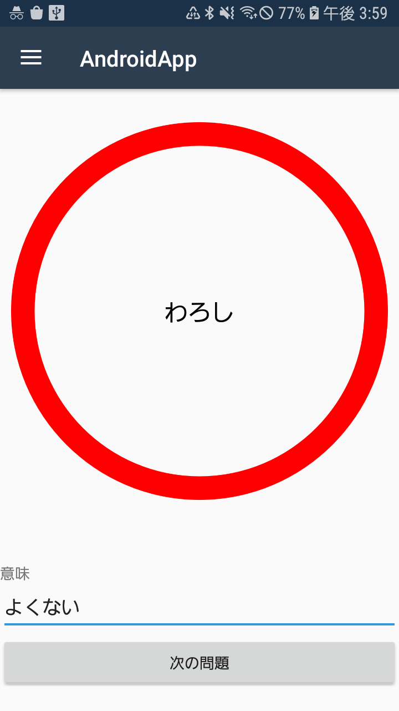
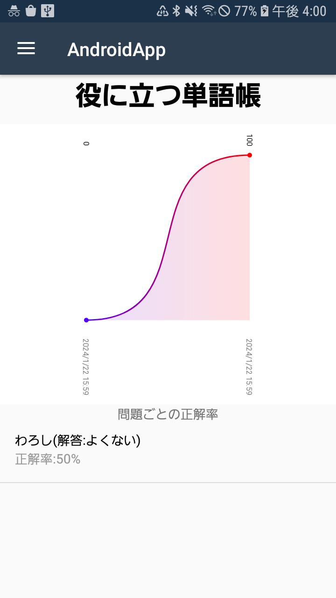
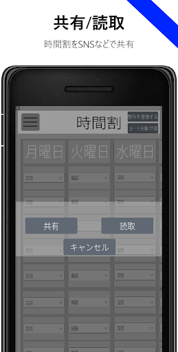

# これまでの成果物
## 2024
### TaskMate（[第2回 C0deハッカソン with pixiv](https://x.com/pixiv_corp/status/1864218084682461636)にて制作）

<video src="assets/works/taskmate/assignmentscreen.mp4" controls  width="180"></video>
  

#### 概要
Moodleサーバーから情報を取得し、未提出/提出済みの課題とその期限をすぐに確認することができるAndroidアプリです。また、ユーザーが指定した時間までに課題を提出していなかった場合、指定されたアプリをロックする機能も実装されています。

ハッカソンではバックエンド1人とアプリ側2人で分担して制作を行い、私はアプリ側のデータレイヤすべてと設定画面のUI（写真右）を担当しました。

詳しくは[こちら](https://qiita.com/Punyo/items/15a8d9fb42ec37f57280)へ

#### 使用技術
- Jetpack Compose
- Ktor
- Node.js（バックエンド）

#### リンク
- [Qiitaでの紹介記事](https://qiita.com/Punyo/items/15a8d9fb42ec37f57280)

### NITechSearch：名工大の講義室使用状況検索アプリ

<video src="assets/works/nitechvacancyviewer/video.mp4" controls  width="180"></video>

#### 概要
事前に数日分の講義室の予約状況をスクレイピングにより大学のサーバーから取得して端末内に保存し、現在空室になっている講義室と建物別の空室の数をすぐに確認できるAndroidアプリです。また、今日の講義室の予約状況と使用時間を部屋別に確認することもできます。

2024年10月から学内向けにGoogle Playにて配信を開始しました。

詳しくは[こちら](works/nitechvacancyviewer)へ

#### 使用技術
- Jetpack Compose 
- Retrofit
- Jsoup
- Tink

#### リンク
- [GitHub](https://github.com/Punyo/NITechVacancyViewer)
- [Google Play](https://play.google.com/store/apps/details?id=com.punyo.nitechvacancyviewer)

## 2021
### 単語帳アプリ

  
  
  
  

#### 概要
項目ごとに単語を登録でき、それらをランダムで出題する機能を有する単語帳アプリです。

単語ごとの正解率を管理する機能も実装されています。

#### 使用技術
- Xamarin.Android

#### リンク
- [GitHub](https://github.com/Punyo/AndroidApp)

## 2019
### 時間割＆ToDo - 時間割、ToDoリスト

  
  
  
  

#### 概要
時間割とToDoリストを管理するためのAndroidアプリです。

時間割機能では、どの曜日に授業があり、何時限あるのかを設定でき、最大10時限まで対応しています。授業内容はあらかじめ30種類が登録されており、さらに追加することも可能です。また、作成した時間割を二次元コードとして出力する機能も実装されています。

ToDo機能では、1か月あたり最大20件のToDoを登録でき、その進捗状況を管理することができます。登録したToDoリストは3か月間保存され、完了したかどうかを追跡することができます。

~~2019年3月からGoogle Playにて配信を開始しました。~~ 現在は配信を停止しています

#### 使用技術
- Unity

#### リンク
- ~~Google Play~~ 配信停止済み