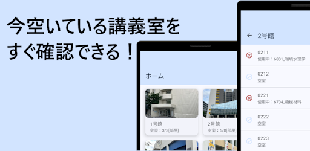
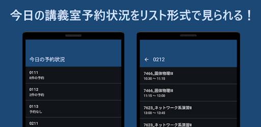
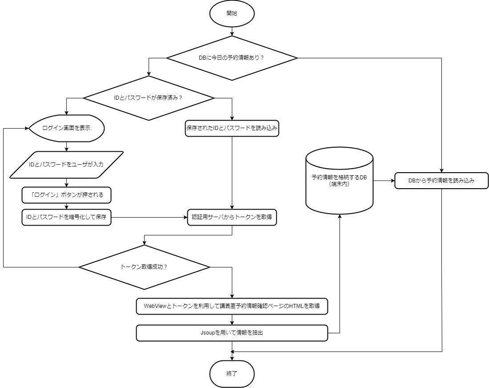

# NITechSearch：名工大の講義室使用状況検索アプリ

## はじめに
初めまして！です.
普段はC0deでUnity製ゲーム用ModやAndroidアプリの制作をしていますが、今回NITMicさんから部誌への記事寄稿のお話を頂き、記事を掲載させていただくこととなりました.

本記事は、筆者が2024年8月～10月に取り組んだAndroid向けアプリ開発のための学習から配信開始までの一連の流れについての記録となります.
なお、今回制作したアプリ[「NITech空室検索 - 名工大の空き教室検索アプリ」](https://play.google.com/store/apps/details?id=com.punyo.nitechvacancyviewer)はGoogle Playで配信中です.
名工大生は下記のQRコードからぜひお試しあれ.

## 制作したアプリについて
### 内容

  
  

 
事前に数日分の講義室の予約状況を大学のサーバーから取得して端末内に保存し、現在空室になっている講義室と建物別の空室の数を（現在の予約状況が保存されている限り）ログインなどの追加操作を挟まずにリアルタイムで確認できるアプリを制作しました。
また、今日の講義室の予約状況と使用時間を部屋別に確認することもできます。

<video src="../assets/works/nitechvacancyviewer/video.mp4" controls  width="180"></video>

### 動機
筆者は以前から「学内システムの情報を使って何かできないかなあ...？」と考えていました. 
ちょうどその時、SNSで弊学学生による以下のような投稿を見かけました. 
なお、以下の文章は原文から一部改変したものとなります.

>今どの教室があいてるかリアルタイムで知ることができたらなあ...？

この投稿からアイデアをもらい、前述したようなアプリを制作しました.

## 制作過程について
筆者はUIをある程度まで問題なく完成させることができました。
しかし、ここでこのアプリを制作する過程で避けられない最大の問題が浮上しました。
それは、

**「どのようにして空室状況を取得するのか」**

という問題です.
今空いている講義室を判定するためには少なくとも現在の講義室の予約情報を手に入れなければなりません.
しかし、講義室の予約情報を取得するAPIは（筆者の知る限りでは）存在しません.
そこで筆者は予約情報の確認ができる学内システムのページからスクレイピングで強引に講義室の予約情報を取得しようと試みました。

スクレイピングを行うにあたって、ここでもう一つの問題が浮上します。
それは「どのようにしてアプリから学内システムの認証を行うか」という問題です。
適切な認証なしでアクセスしようとするとログイン画面へリダイレクトされてしまいます。
この問題を解決するために、認証～学内システムへのログインまでの通信を調べ認証方法に関しての検証を行いました。

検証によって得られたログインまでの詳細を以下の図に示します。
（括弧内のダブルクォーテーションで囲まれた文字列はそれらのメッセージ内での名称を表しています）

これらを踏まえて、RetrofitとJsoupを用いて認証とHTMLの解析を実装しました。

前述したものをすべて実装した後、学内システムにアクセスするための認証情報をユーザーに要求するログイン画面、Tinkを用いて保存時に認証情報を暗号化する機能、Roomを用いて内部に取得した予約情報を保存する機能を実装して、最終的に講義室の予約情報を取得する処理は以下のフローチャートのようになりました。

## さいごに
以上、筆者がKotlinの学習からアプリの配信を開始するまでの一連の流れについての記録でした.
ここまでお読みいただいた読者の方の中には、「敷居が高そうだなあ...」と感じた方もいらっしゃるかもしれません.

でも、「**自分が作ったアプリが顔の見えない誰かに使ってもらえるかもしれない**」と考えるとドキドキしませんか？

少しでもドキドキした方はぜひ開発者登録をしてアプリ配信にチャレンジしてみてください！