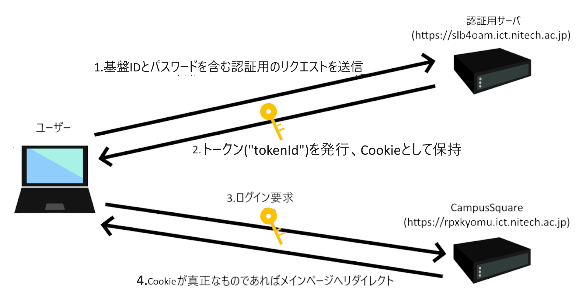
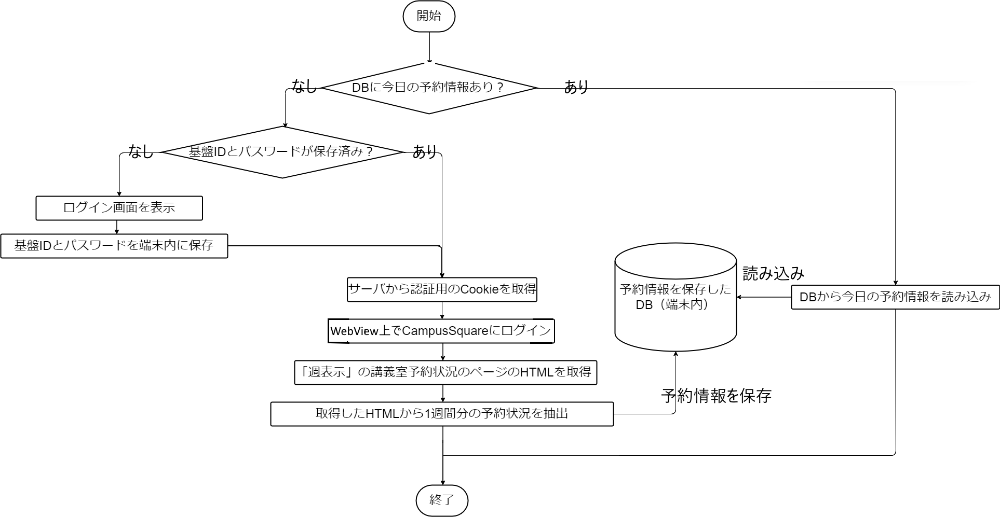

# NITechSearch：名工大の講義室使用状況検索アプリ

## はじめに
初めまして！です.
普段はC0deでUnity製ゲーム用ModやAndroidアプリの制作をしていますが、今回NITMicさんから部誌への記事寄稿のお話を頂き、記事を掲載させていただくこととなりました.

本記事は、筆者が2024年8月～10月に取り組んだAndroid向けアプリ開発のための学習から配信開始までの一連の流れについての記録となります.
なお、今回制作したアプリ[「NITech空室検索 - 名工大の空き教室検索アプリ」](https://play.google.com/store/apps/details?id=com.punyo.nitechvacancyviewer)はGoogle Playで配信中です.
名工大生は下記のQRコードからぜひお試しあれ.

## 制作したアプリについて
### 内容

事前に数日分の講義室の予約状況を大学のサーバーから取得して端末内に保存し、現在空室になっている講義室と建物別の空室の数を（現在の予約状況が保存されている限り）ログインなどの追加操作を挟まずに確認できるアプリを制作しました.
また、今日の講義室の予約状況と使用時間を部屋別に確認することもできます.

### 動機
このアプリを制作するに至った主な動機として、次の2つが挙げられます.
- Jetpack Composeを使ったことがなかった

筆者は2017年の夏に参加したプログラミングキャンプで初めてAndroidアプリの制作を体験し、その後2019年までJavaやC#を用いて制作を続け、以降はUnityでのゲームやMod制作に手を付け始めました.
その為、それ以降に主流となったJetpack Composeを利用したUI設計の経験は皆無でした.

幸いにも2024年の8月はまとまった時間をとることができたため、折角なのでJetpack Composeを用いた開発の学習も兼ねて制作を決定しました.

- 学内システムから得られる情報を使ったアプリが作りたかった

筆者は以前から「学内システムの情報を使って何かできないかなあ...？」と考えていました. 
ちょうどその時、SNSで弊学学生による以下のような投稿を見かけました. 
なお、以下の文章は原文から一部改変したものとなります.

>今どの教室があいてるかリアルタイムで知ることができたらなあ...？

この投稿からアイデアをもらい、前述したようなアプリを制作しました.

## 学習から配信開始までの流れ
### 1. Kotlinの学習

Googleが公開している[「Compose を用いた Android アプリ開発の基礎」](https://developer.android.com/courses/android-basics-compose/course?hl=ja)から学習を始めました.
このコースを完了したのちに、本番のアプリ制作を開始しました.
制作を開始した後も足りない部分をドキュメントで補充した上、前述したコースを復習をするなどして制作と学習を並行して進めました.

### 2. アプリ制作
前述したコースで最低限の勉強を終えたおかげで、筆者はUIをある程度まで問題なく完成させることができました.
しかし、ここでこのアプリを制作する過程で避けられない最大の問題が浮上しました.
それは、

**「どのようにして空室状況を取得するのか」**

という問題です.
今空いている講義室を判定するためには少なくとも現在の講義室の予約情報を手に入れなければなりません.
しかし、講義室の予約情報を取得するAPIは（筆者の知る限りでは）存在しません.
そこで筆者は予約情報の確認ができる学内システムのページからスクレイピングで強引に講義室の予約情報を取得しようと試みました.

スクレイピングを行うにあたって、ここでもう一つの問題が浮上します.
それは「どのようにしてアプリから学内システムの認証を突破するか」という問題です.
適切な認証なしでアクセスしようとするとログイン画面へリダイレクトされてしまいます.
この問題を解決するために、プロキシサーバを用いて認証～学内システムへのログインまでの通信を調べ認証方法に関しての検証を行いました.

検証によって得られたログインまでの詳細を以下の図に示します.
（括弧内のダブルクォーテーションで囲まれた文字列はそれらのメッセージ内での名称を表しています）

これらを踏まえて、今回はRetrofitとJsoupを利用して認証とスクレイピングを実装しました。

前述したものをすべて実装した後、学内システムにアクセスするための認証情報をユーザーに要求するログイン画面や、端末内に取得した情報をキャッシュする仕組みを追加で実装し、最終的に講義室の予約情報を取得する処理は以下のフローチャートのようになりました.

### 3. 配信準備
アプリが完成していよいよ配信！となってもまだやるべきことはたくさん残っています.

1. アイコンの作成

    弊学のパンフレットや公式サイトの多くが青系統の色を基調としており、その中でも2号館をモチーフにしたデザインが多いと感じたため、Background Layerに青系統の色（#43679C）を用いた上で2号館の空室数表示（左）をトレースしたものをForeground Layerに設定したアイコン（右）を作成しました.

    
        

2. 利用規約とプライバシーポリシーの作成
    
    利用規約にはユーザーに遵守を求める事柄について、プライバシーポリシーにはユーザーからどのような情報を取得するか、その情報をどのように利用するかについて記述します.
    また、作成後はお好みのホスティングサービスを利用して両者をユーザーが閲覧できる形で公開する必要があります.
    今回はGitHub Pagesを利用して公開しました.

4. 掲載情報の設定

    <!--  -->

    Playストアでユーザーが目にする掲載情報を設定します.
    アプリ名、簡単な説明、詳しい説明、アイコン、フィーチャーグラフィック（ストアページ上部に表示される画像）、スクリーンショットを指定された枚数以上設定する必要があります.

5. 審査準備

    Google Play上のすべてのアプリは、不適切な表現を用いることやユーザーのデバイスを不正に利用することを禁じたポリシーを遵守しているか判定する審査を通過した後に配信されています.
    このポリシーに違反した場合ストアでの配信を拒否されたり、アプリが削除される場合があります.

    ちなみに、**筆者には中学生の時にポリシー違反を犯しアプリを削除された前科があります.** ~~経験者は語る~~
    
    だから、今回はPlay Consoleから審査のための情報を不足なく入力した後で申請する必要があったんですね.（1敗）
    
    

    この画面からアプリのコンテンツに関する以下の内容について申告する必要があります.

    - プライバシーポリシーのURL
    - 広告IDの使用目的
    - アプリが収集するデータの種類と送信時の暗号化の有無
    - アプリの対象年齢
    - アプリの全領域へアクセスする方法
    - 取得したレーティング情報
    - 広告の有無
    - ニュースアプリであるかどうか
    - 政府機関からの委託で作成したアプリであるかどうか
    - 金融取引機能の有無
    - 健康関連の機能の有無

    その数なんと11項目！さらに、レーティング取得のために追加で別の質問票にも回答する必要があります.
    折角アプリ制作が終わったのにやるべきことがかなり増えてしまいましたね.
    この中に1つでも不備があると~~中学時代のように~~アプリ削除や配信拒否の憂き目に遭ってしまいます.

    また、前述した通り審査のためにアプリの全領域へアクセスする方法を提供しなければならないため、ログイン画面の基盤IDとパスワードを入力する箇所に特定の文字列を入力すると強制的に空室状況の確認画面に遷移できる審査用の「デモモード」を申請前に追加で実装しました.

6. 審査申請

    ここまで入力すれば後はPlay Consoleから製品版をリリースして審査申請完了です.
    申請から2～3日ほどで世界中のどこか（このアプリの場合はルーマニアとアメリカでした）のGoogleのオフィスで審査が行われ、問題が見つからなければ配信が開始されます.

    **今回制作したアプリは1回目の申請で配信拒否され、以下のようなメールが届きました.~~（憂き目に遭ってしまいましたね）~~**

    

    配信を拒否された場合、送信されたメールにアプリのどの箇所がどのポリシーに違反しているかについての詳細な情報が記載されているため、その指示に従って修正後再申請する必要があります.
    今回のアプリではこのメールに従って修正を行い、再申請を行った後配信を開始することができました.

## さいごに
以上、筆者がKotlinの学習からアプリの配信を開始するまでの一連の流れについての記録でした.
ここまでお読みいただいた読者の方の中には、「敷居が高そうだなあ...」と感じた方もいらっしゃるかもしれません.

でも、「**自分が作ったアプリが顔の見えない誰かに使ってもらえるかもしれない**」と考えるとドキドキしませんか？

少しでもドキドキした方はぜひ開発者登録をしてアプリ配信にチャレンジしてみてください！